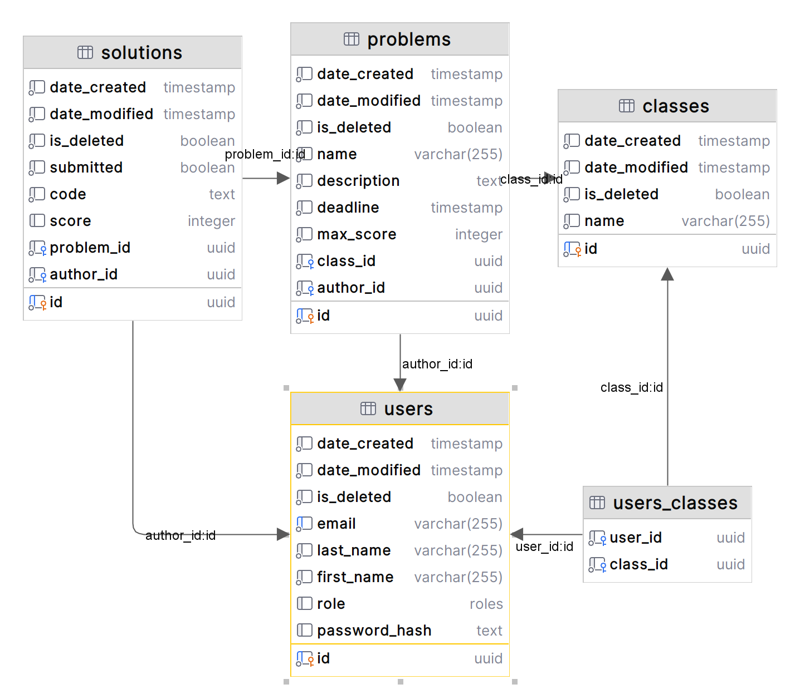

# Educational Coding Platform

## Development

After cloning the repository, run the following commands to initialize the repo.

```bash
pnpm install		# install project dependencies
pnpm run prepare	# initializes husky, for git hooks
```

The following is a list of the primary scripts for the project.

```bash
pnpm run dev		# start development server
pnpm run build		# build project
pnpm run start		# start server for production
pnpm run lint		# lint codebase with ESLint
pnpm run tscheck	# typecheck codebase with Typescript
pnpm run format		# format codebase with Prettier
```

## API

This project uses the following tech for the API.

- [tRPC](https://trpc.io/): End-to-end type-safe client-server communication
- [Zod](https://zod.dev/): Declarative data validation with user-defined schemas

An interactive documentation page for the tRPC API can be found at `/api/trpc` _during **development** only_.

**tRPC API** (formatted with [tree.nathanfriend.com](https://tree.nathanfriend.com/)):

```
.
├── ping: healthcheck server
├── users/
│   ├── find: 1 user
│   ├── list: many users
│   ├── create
│   ├── update
│   └── remove
├── classes/
│   ├── find: 1 class
│   ├── list: classes where user has access
│   ├── create
│   ├── update
│   └── remove
├── problems/
│   ├── find: 1 class
│   ├── list: problems from all classes where user has access
│   ├── create
│   ├── update
│   └── remove
└── solutions/
    ├── find: 1 solution
    ├── find_latest: latest solution for problem
    ├── list: authored solutions (? for a problem)
    ├── list_latest: latest solutions from all users for a problem
    └── create
```

## Database

```bash
pnpm exec drizzle-kit studio		# start database gui client
pnpm exec drizzle-kit generate		# generate migration files
pnpm exec drizzle-kit migrate		# apply migration files
```

- See [Drizzle Studio](https://orm.drizzle.team/docs/drizzle-kit-studio): quickly viewing contents of the database.

**Database Schema** (formatted with [Jetbrains DataGrip](https://www.jetbrains.com/datagrip/))


## Tooling

This project uses the following tools to enforce consistent coding conventions, formatting, and automated workflows:

### Formatting & Linting

- [Prettier](https://prettier.io/): Enforces consistent code formatting.
- [ESLint](https://eslint.org/): Enforces best practices on coding conventions.
- [Typescript](http://typescriptlang.org/): Provides static typing and checks.
- [CommitLint](https://commitlint.js.org/): Standardizes commit messages based on [Conventional Commits](https://www.conventionalcommits.org/).

### Automation

- [Github Actions](https://github.com/features/actions): Automates CI workflows, including formatting & linting.
